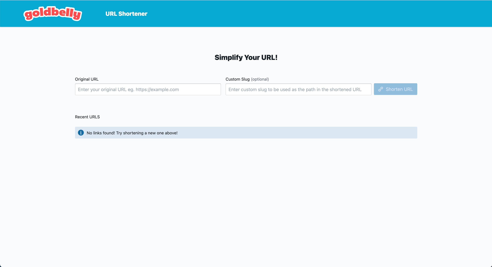
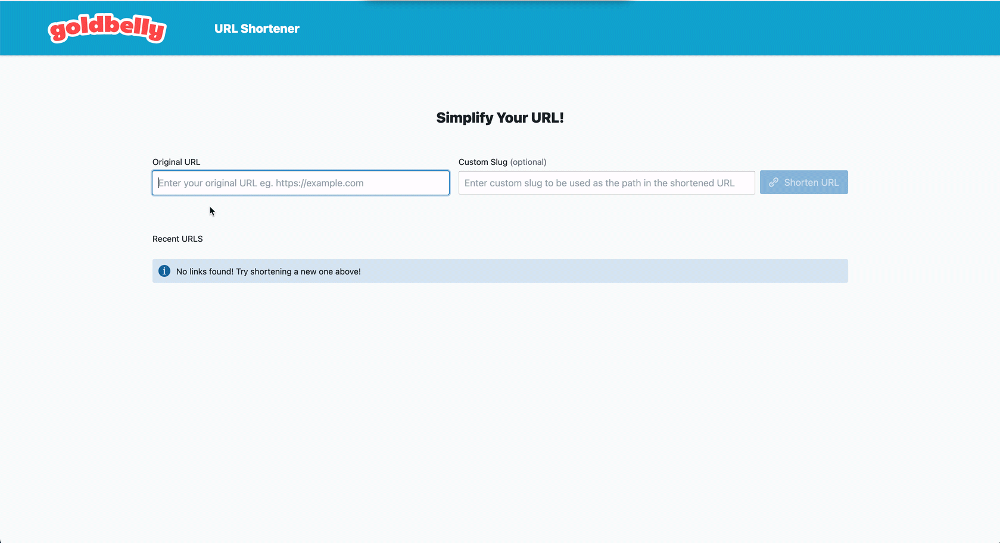
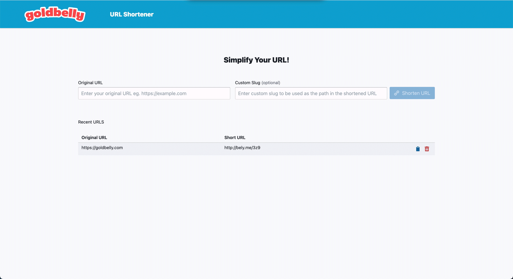

# URL Shortener React Interview Test

### Starting the Project

To correctly get everything working, first you will need an API_KEY supplied through env variables. Create a `.env` file and add your API_KEY. See `.env.sample` for an example. Then simply run `yarn` to install any dependencies and `yarn dev` to serve up the project.

## Commands

### Install

```bash
# install node modules
yarn
```

### Run

```bash
# view at http://localhost:8080/
yarn dev
```

### Test

```bash
# runs jest tests
yarn test
```

### Other

```bash
# runs prettier on files to ensure clean coding practices
yarn format
```

```bash
# runs eslint on files to ensure clean coding practices
yarn lint
```

```bash
# checks for any typing errors
yarn typecheck
```

# My Approach

High level I created a one page react app, using `typescript`, `React.Context` for state management, and `axios` to communicate with the API.

It should look like this initially:


### Requests to the API

At first I used the [react-request-hook](https://github.com/schettino/react-request-hook) library to manage requests to the backend. Unfortunately this proved too basic and did not meet my requirements. Two issues occured with this lib

1. Requests returned from the hooks were synchronous. This meant that on some requests that didn't return data like `DELETE` there was no way to determine if the request was successful except by the checking if the request didn't fail.
2. Errors were not correctly propagating through to the errors objects supplied from the request-hook since error messages for some endpoints are returned as a response.

To combat these problems I decided to create a small request hook that sends axios requests, extracts errors from responses, handles loading, and uses the same interface as `react-request-hook` since its a pattern already commonly used from other packages like `@apollo/client`.

In the future I would look more into what request libraries are already existing our flesh out my current hook approach. This main issue with the current hook approach is that requests are "shared". Meaning that you cannot have different instances of the `DELETE` request for example so they all share the same loading/error/data state.

### State Management

I decided to store everything in react context for simplicity. The context is shaped to mimic the API with seperate requests as keys and then request state (loading/data/error) plus a request function as their properties.

This was nice because it allowed me to refresh states after some requests. Example creating a URL should trigger refreshing the list or URLs to get the newest URL. Using context allows me to avoid needing to pass request information around as component props, and is an easy way to have to seperate components have side effects on one another.

In the future I would have used a more reboust state management framework. I am most familiar with `Mobx` and `Overmind`. Both of these allow us to have derived state, reactions/side-effects, and compartmentalize the state object a little better. A pattern in the past I've used is splitting the state into `api` with the basic axios requests to easily access anywhere, then component/app level keys for data. For example we could have a "URLs" property that stores the list of URLS. Organizing like this could be nice since we can cut down on the ammount of requests sent, by appending the URLs property with any created URLs instead of fetching an entire new list.

Persistent state between sessions isn't necessary since its not overly expensive to fetch the new list of urls on page load.

### Testing

For testing, I used `jest` and the recommended `@testing-library/react` to test the two major components (the `<Shortener/>` and the `<URLTable/>`).

Since the api/context is accessed through a util, we can mock that util with a stubbed out API and check that calls happen without actually sending axios requests.

This was the first time I've used this library for testing, but found it quite easy to work with. My favorite thing was how it printed out HTML to the terminal on failing cases so you can see how your components actually rendered.

Since our components have side effects that affect other components, in the future in might be good to run full end-to-end tests to ensure everything is updated correctly. Example when you create a URL from the `<Shortener/>` it causes the `<URLTable/>` to re-render.

### Minor Additions

Added [TailwindCss](https://tailwindcss.com/) for some quick classnames to help with styling. I added the default css file, but more custom configurations can and should be used.

Added BlueprintJS for some quick premade components.

### Other Thoughts

Although not entirely necessary, when working with an external API I would have liked to create my own little API service to wrap it. This would allow us to normalize errorr messaging, add extra authentication (if needed), and potentially even add a caching layer assuming the external API doesn't already use one.

Another improvement I would have liked to make was some better validation. I noticed that the Goldbelly API allows shortening for incorrect URLs or in some cases returns a 200 when trying to create a URL that already exists. This could be handled on the frontend, in a more robust Request method, or can be handled in a custom API mentioned above.

## The Flow

Creating a URL



List of URLS


Deleting a URL


